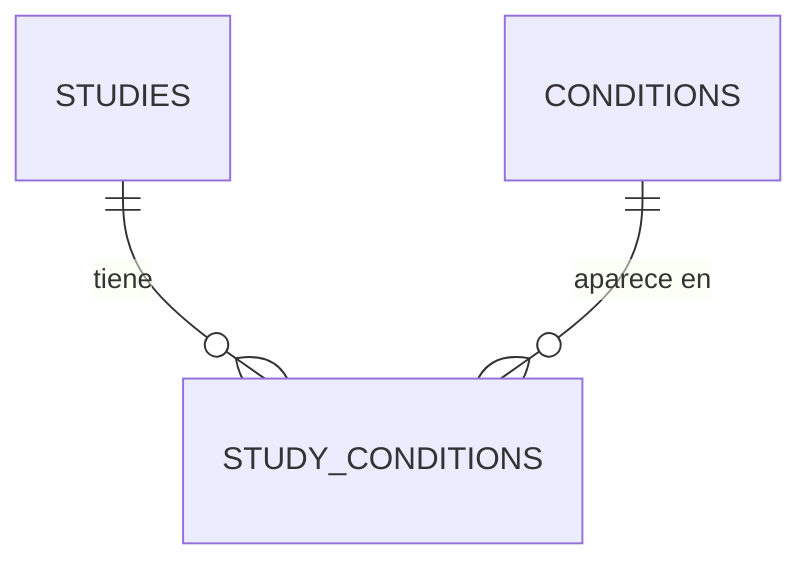
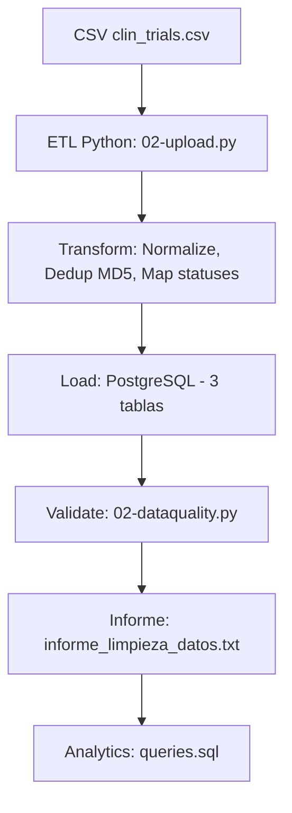

# Pipeline de Datos de Ensayos Clínicos

## Abordar el Proyecto

El primer paso era leer el reto y estructurar los primeros pasos. La elección del set de datos no era tarea fácil. Opté por el más simple para poder dedicar más tiempo al desarrollo: la opción (2) de un simple CSV, que demostró tener bastante suciedad que limpiar.

Mi segunda parte, si esto concluía, era abordar la ingesta desde diferentes orígenes de datos. De esta parte poco he podido completar, como explico al final del documento.

---

## Decisiones de Diseño

Dado un solo CSV masivo de ensayos clínicos, el primer paso era ser capaz de ingestarlo y determinar sus problemas de datos.

Decisiones de implementación del pipeline:

- **Origen:** CSV
- **Lenguaje:** Python (con Pandas, que era divina para esto)
- **Base de datos:** PostgreSQL, cargada en local desde Docker
- **Control de versiones:** GitHub

---

## Configurando el Entorno *(apartado con ayuda de IA)*

Clonar el repo: `https://github.com/Jaumet-007/migx.git`

1. **Instala dependencias:** Crea un virtualenv y ejecuta `pip install -r requirements.txt` (incluye pandas, sqlalchemy, etc.).
2. **Levanta PostgreSQL con Docker:** `docker-compose up -d` (usando `docker-compose.yml` con usuario `migx_user`, pw `migx_password`, puerto `5434`, db `clinical_db`).

Después, desarrollar desde Visual Studio el código.

---

## Primera Aproximación: Revisando el CSV Origen

El primer análisis del fichero llevó a un diseño inicial sencillo:

1. Esquema de base de datos con 2 tablas: `studies` y `conditions`.
2. Carga con Python aplicando unas primeras depuraciones:
   - Transformar fechas al tipo fecha: `df['Start Date'] = pd.to_datetime(df['Start Date'], errors='coerce')`
   - Normalizar valores multi-valor (separados por coma o pipe), que se cargarían en la tabla `conditions`
   - Eliminar duplicados intra-fila con `cond_df.drop_duplicates()` y usar `TRUNCATE` para recargas

El resultado de esta fase es `01-create.sql` y `01-upload.py`, que como veremos no serán la versión definitiva.

Para ejecutar esta primera versión:

1. **Crea esquema:** `psql -U migx_user -d clinical_db -f database/01-create.sql` (o desde pgAdmin en `http://localhost:5052/browser/`)
2. **Carga datos:** `python database/01-upload.py`

---

## Análisis de la Primera Aproximación

La primera aproximación, aunque funcional como prototipo mínimo, sufría de varios problemas que la hacían poco robusta para uso real:

**Ausencia de identificador único natural.** La IA concluye que debería existir el campo estándar NCT Number (obligatorio en ClinicalTrials.gov y en casi todos los datasets de Kaggle derivados). En cambio, la tabla usaba un `study_id` numérico basado en el índice de Pandas, que es frágil y no idempotente (cambia si se reordena el CSV o se recarga).

**Alta redundancia en condiciones.** Se almacenaban repetidas en `study_conditions` sin tabla separada. El mismo string ("diabetes", "Arthroplasty Complications") se repetía miles de veces, y sin tabla `conditions` con valores únicos era imposible corregir errores tipográficos o estandarizar en un solo lugar.

**Pérdida de columnas clave.** Solo se cargaban unas pocas columnas, limitando la analítica posterior.

**Datos aún sucios.** El análisis del CSV reveló varios problemas que la versión 1 no resolvía:

- Fechas en formatos variables (ej. "2004-10", "2021-01-01") sin conversión robusta, con riesgo de NULLs o errores.
- Valores nulos, "NA" o "Unknown" en fases y estados sin validación, causando inconsistencias en agregaciones.
- Tipos mixtos no manejados, generando warnings y coerciones erróneas.
- Sin garantía de orden de inserción, con riesgo de cargar relaciones con IDs inexistentes.
- Sin chequeos de duplicados parciales, valores inválidos o huérfanos en relaciones.
- Sin logging ni informe de calidad, lo que dificultaba depurar problemas.

---

## Segunda Aproximación: Modelo Entidad-Relación

El nuevo esquema pasa a 3 tablas: `studies`, `conditions` y `study_conditions`.

**Ventajas:** Mayor escalabilidad con millones de registros, y sin repetición de estudios ni condiciones. La tabla `study_conditions` actúa como tabla N:M que los relaciona.

**Problema detectado:** Hay repetición en estudios. Por ejemplo, "Sun Protection Factor Assay" aparece hasta 6 veces con fechas de inicio distintas y el resto de campos iguales.

La decisión fue no crear una tabla adicional para versiones de un mismo estudio por estas razones:

- No disponemos de un campo `version` en el origen que permita trazabilidad clara.
- Añadiría complejidad innecesaria y penalizaría el rendimiento con JOINs redundantes.

En su lugar, se optó por limpiar y organizar la información antes de guardarla mediante una huella digital (hash MD5) que combina `brief_title`, `full_title`, `organization_full_name` y `start_date`, ignorando repeticiones y quedándose con la primera ocurrencia.



---

## Segunda Aproximación: Ingestión con Python

A partir de los problemas identificados, se construyó un pipeline definitivo. Le pedí a la IA que aplicara las reglas clásicas de repetición, duplicados y errores humanos o de tipología, pero que validara también por el CSV otras validaciones que se podían escapar.

**Validaciones incorporadas al pipeline:**

- Normalización automática de nombres de columnas (snake_case + mapeo explícito), evitando errores por diferencias de formato entre CSV y esquema SQL.
- Generación de `study_key` con hash MD5 determinístico, que elimina duplicados reales y parciales de forma idempotente (mismo CSV = mismos keys siempre).
- Detección y advertencia de valores inesperados en estados, permitiendo identificar anomalías sin abortar la carga.
- Opción para filtrado estricto de filas inválidas, dando flexibilidad entre tolerancia y rigurosidad.
- Extracción limpia de condiciones (split por coma/pipe, minúsculas, longitud mínima >= 3 caracteres), reduciendo ruido y strings vacíos.
- Carga secuencial garantizada (primero condiciones únicas, luego map de IDs, luego estudios y relaciones), eliminando riesgo de integridad referencial rota.
- Conversión segura de tipos con `pd.to_datetime(errors='coerce')`, manejando formatos variables sin crash.

**Validación adicional sugerida por la IA, surgida de varias cargas fallidas en cuanto al CHECK de estados:** Mapeo suave de estados raros en `overall_status` (ej. `'AVAILABLE'` se traduce a `'APPROVED_FOR_MARKETING'`), previniendo violaciones de CHECK constraint sin perder filas. La IA sugiere que en lugar de ampliar infinitamente el CHECK, dado que ClinicalTrials.gov tiene aproximadamente 15 estados oficiales, es más fácil de escalar si en el futuro se decide que AVAILABLE es otro estado: basta con cambiar líneas de script en lugar de alterar la estructura de la tabla.

**Mejoras de escalabilidad y mantenimiento** (pedidas explícitamente a la IA para que el código fuera más fácil de mantener y extender):

- Diseño modular con funciones separadas (`generate_study_key`, `normalize_column_names`, `extract_conditions`, `normalize_statuses`), fáciles de testear, reutilizar y extender.
- Logging estructurado con timestamps y niveles (INFO / WARNING / ERROR).
- Transacción atómica con `engine.begin()` y `TRUNCATE CASCADE`, asegurando consistencia total en recargas.
- Deduplicación temprana con `drop_duplicates(subset='study_key')`, reduciendo volumen antes de insertar.
- Código preparado para volúmenes mayores: `low_memory=False`, `dtype=str` inicial.
- Posibilidad de migrar a Spark/Parquet sin cambiar la lógica central.

---

## Tests Unitarios

Los tests unitarios garantizan tres cosas fundamentales:

**Fiabilidad.** Aseguran que las reglas de limpieza (como separar condiciones o normalizar fechas) funcionen siempre igual, evitando que datos sucios arruinen las métricas de negocio.

**Idempotencia.** Validan que el sistema procese la misma información varias veces sin duplicar registros ni corromper la base de datos.

**Mantenimiento.** Permiten evolucionar el código con confianza. Si mañana se cambia una función para mejorar el rendimiento, los tests confirman en segundos que no se ha roto la lógica del pipeline.

El código y los resultados están en la carpeta `/tests`.

---

## Calidad de los Datos

Recién cargado el dataset, se implementó un script Python que ejecuta las queries de validación y genera un informe legible:

```
python database/02-dataquality.py
```

Esto produce `informe_limpieza_datos.txt` con 6 chequeos:

1. **Unicidad en nombres de condiciones.** Detecta si hay condiciones duplicadas (debería devolver 0 filas, ya que `condition_name` es UNIQUE). Evita que conteos se inflen artificialmente.

2. **Integridad referencial en relaciones.** Verifica que no haya referencias inválidas en `study_conditions`. Garantiza que los JOINs en analítica funcionen correctamente.

3. **Completitud en campos clave.** Cuenta valores NULL o vacíos en columnas críticas (título, organización, estado, fecha). Sin título no se puede identificar un estudio; sin fecha no se puede calcular su duración.

4. **Consistencia lógica en fechas.** Detecta fechas de finalización anteriores a las de inicio, fechas futuras irreales o estudios completados sin fecha de fin.

5. **Outliers en número de condiciones por estudio.** Identifica estudios con 0 condiciones o con un número excesivo (más de 10 podría ser un error de parseo en el CSV).

6. **Duplicados parciales.** Agrupa estudios por título y organización y muestra grupos con más de 1 registro, para detectar casos como el de Bayer SPF con 6 entradas.

### Conclusión de Calidad

**Hallazgos críticos:**

- El 44% de los registros (219.166) no tienen `start_date`, lo que impide análisis temporal.
- 32 estudios tienen fechas erróneas (ej. año 2026).
- 2.671 registros tienen más de 10 condiciones, posible fallo de parseo.
- 763 grupos con mismo título y empresa pero datos inconsistentes (ej. Bayer con 12 registros y 9 fechas distintas; también NCI, Alcon y Novo Nordisk).

**Diagnóstico:** Integridad referencial correcta, pero datos fuente sucios.

**Acciones requeridas:**

- Validar si los nulos y duplicados vienen del CSV fuente.
- Revisar la lógica de separación en la columna "Conditions".
- Establecer una regla de negocio para deduplicación (ej. mantener el registro más antiguo o el más completo).
- Revisar una muestra de filas problemáticas para validación conjunta.

---

## Analytics Requeridos en el Challenge

El challenge pide una serie de preguntas que se responden mediante queries SQL. Dado que los LLM actuales son bastante buenos generando SQL, las queries se generaron con ayuda de IA. Dicho esto, con 30 años trabajando con SQL, estoy en condiciones de generarlas yo mismo sin problema y de explicarlas en detalle si se requiere.


El resultado de todas las queries (analytics/queries.sql) se ha resumido en el informe:
`analytics/analytics_report.md`        

```
psql -U migx_user -d clinical_db -f analytics/queries.sql
```

## 
---

## Diagrama de Arquitectura (obviando la version 1)



---

## Tareas Pendientes: Otros Origenes de Datos

**XML.** Se usaría `xml.etree.ElementTree` o `lxml` para parsear el XML y extraer campos equivalentes. El cambio sería mínimo: reemplazar `pd.read_csv()` por una función `parse_xml_to_df(xml_path)` que devuelva un DataFrame con la misma estructura.

**API.** Aprovechando las funciones de Python para cargar sobre un DataFrame:

```python
def load_from_api(query: str = "cond=cancer", max_results=1000) -> pd.DataFrame:
    url = "https://clinicaltrials.gov/api/v2/studies"
    params = {"query.cond": query, "pageSize": 1000, "format": "json"}
    response = requests.get(url, params=params)
    data = response.json().get('studies', [])
    df = pd.json_normalize(data)
    return df
```

**Otras bases de datos.** Usando SQLAlchemy para leer directamente sobre un DataFrame:

```python
def load_from_db(db_url: str, query: str = "SELECT * FROM clinical_trials") -> pd.DataFrame:
    engine = create_engine(db_url)
    return pd.read_sql(query, engine)
```

---

## Otras Tareas Pendientes

- **CI/CD:** Crear `.github/workflows/ci.yml` con GitHub Actions para ejecutar en cada push: instalación de dependencias, validación de calidad y construcción de imagen Docker.
- **Gestión de secretos:** Añadir `.env.example`, incluir `.env` en `.gitignore` y actualizar el código para usar `python-dotenv` + `os.getenv()`.
- **CI seguro:** Tomar `DB_URL` desde Secrets de GitHub, no desde archivos.
- **Orquestación:** Añadir un flujo mínimo (ETL > validaciones > analytics).
- **Producción:** Plan de migración a Secrets Manager (Vault / AWS / Azure), rotación de credenciales y roles con principio de menor privilegio.

---

## Preguntas Bonus

**Escalabilidad: ¿Cómo manejarías 100 veces más volumen de datos?**

Usar almacenamiento en nube con formatos comprimidos como Parquet.
Particionamiento de tablas por fecha cuando el volumen lo requiera. 
Valorar el uso de vistas materializadas para acelerar consultas frecuentes.

**Calidad de datos: ¿Qué validaciones adicionales implementarías?**

Añadir campo de completion_date para tener el rango real de fechas del estudio
Añadir si es posible en NCT id como clave del estudio
Añadir si es posible la version del estudio para adaptar una nueva tabla 1 estudio: N versiones (con diferente StartDate)
Generar un diccionario/tabla de vocablos. No todo texto es válido
Revisar la congruencia de todos los tipos de datos
Revisar valores errores o nulos hay y no deberiamos permitir

**Cumplimiento normativo: ¿Qué habría que tener en cuenta en un entorno GxP?**

Tres capas de entorno: DEV, TEST y PROD. 
Auditoría de creaciones y modificaciones de registros (usuario y fecha). 
Seguridad basada en tipología de usuarios y roles. 
Estandarización en codificación y nomenclatura.

**Monitoreo: ¿Cómo monitorizarías este pipeline en producción?**

Métricas de throughput, latency, error rate, filas procesadas y calidad (nulos, duplicados). 
Logging a varios niveles. 
Alertas automáticas ante errores graves o incumplimiento de los compromisos de tiempo (RPO/RTO). Monitorización de índices y estadísticas de la base de datos, especialmente si hay queries pesadas frecuentes.

**Seguridad: ¿Qué medidas aplicarías para datos clínicos sensibles?**

Uso de gestores de secretos (ej. AWS Secrets Manager) para credenciales. 
Seguridad basada en roles de usuario. 
Base de datos con anonimización de datos y valorar el coste/beneficio de la encriptación. 
Auditoría de accesos.
