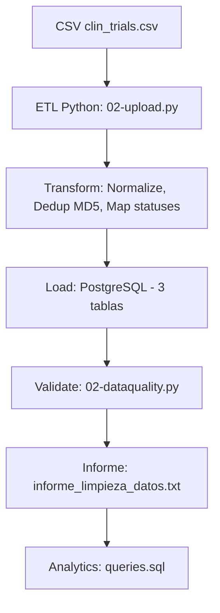

# Pipeline de Datos de Ensayos Clínicos

## Abordar el Proyecto
El primer paso por supuesto era leer el reto y estructurar los primeros pasos. la elección del set de datos no era tarea facil.
Opté por el más simple para poder dedicar más tiempo al desarrollo y opté por la opción (2) de un simple CSV (que demostró tener bastante suciedad que limpiar)

Mi segunda parte si esto concluia era abordar la diferente ingesta de diferentes origenes de datos. Y de esta parte poco he podido completar como explico en la parte final.

## Decisiones de diseño:
Dado un solo CSV masivo de ensayos clínicos, el primer paso era ser capaz de ingestarlo. y determinar sus problemas de datos.

Decisiones de implementación del Pipeline:

Origen: CSV
Lenguaje: Python cuya libreria Pandas era divina.
Base de datos: PostgresSQL (cargada en local desde Docker)
control de versiones: GitHub.

## Configurando el entorno (apartado con ayuda de IA):
clonar el repo --> https://github.com/Jaumet-007/migx.git

1. **Instala dependencias:** Crea un virtualenv y ejecuta `pip install -r requirements.txt` (incluye pandas, sqlalchemy, etc.).
2. **Levanta PostgreSQL con Docker:** `docker-compose up -d` (usando `docker-compose.yml` con usuario `migx_user`, pw `migx_password`, puerto `5434`, db `clinical_db`).

y desarrollar desde Visual Studio el código.

## Primera aproximación revisando el CSV origen.
1-Esquema de BD de 2 tablas (Studies y conditions)
2-Carga python con unas primeras depuraciones
    - transformar fechas básicas al tipo fecha
        df['Start Date'] = pd.to_datetime(df['Start Date'], errors='coerce')
    - normaliza multi-valor (separadas por coma o pipe) que se cargaran en una tabla conditions

    - y set para evitar duplicados intra-fila y usa TRUNCATE para recargas
        cond_df = cond_df.drop_duplicates()

3-El resultado es 01-create.sql y 01-upload.py que veremos que no es el definitivo

1. **Crea esquema:** `psql -U migx_user -d clinical_db -f database/01-create.sql` (pgAdmin http://localhost:5052/browser/).
2. **Carga datos:** `python database/01-upload.py` (desde el terminal de VS - pipeline que lee CSV, transforma, inserta).

## Analisis de la primera aproximación.
La primera aproximación aunque funcional para un prototipo mínimo, sufría de fragilidad en claves, redundancia alta, pérdida de información útil, falta de robustez ante datos reales sucios y ausencia de controles de calidad, lo que limitaba su utilidad para analítica y producción:

Ausencia de identificador único natural (NCT Number):

    La IA nos concluye que debería existir el campo estándar NCT Number (obligatorio en ClinicalTrials.gov y en casi todos los datasets de Kaggle derivados). La tabla tenía un study_id numérico arbitrario basado en el índice de Pandas 
    (frágil, no idempotente (cambia si se reordena el CSV o se recarga))

Alta redundancia en Condiciones multi-valor 
    Se almacenaban repetidas en study_conditions sin tabla separada. Mismo string ("diabetes", "Arthroplasty Complications") se repetía miles de veces.
    No había tabla conditions con valores únicos → imposible corregir typos o estandarizar en un solo lugar.

Pérdida de columnas clave para analítica
    Solo se cargaban unas pocas columnas (org_name, status, start_date, phase, study_type).

Los datos seguían sucios. El análisis por IA del CSV nos encuentra algunos problemas que la versión 1 no resolvia:

    Fechas en formatos variables (ej. "2004-10", "2021-01-01") sin conversión robusta → riesgo de NULLs o errores.
    Valores nulos, "NA", "Unknown" en fases/status sin validación → inconsistencias en agregaciones.
    Tipos mixtos no manejados (strings vs numéricos) → warnings y posibles coerciones erróneas.

    Carga no secuencial → riesgo de integridad referencial
    No se garantizaba orden de inserción (primero conditions únicas, luego studies, luego relaciones) → posible carga de relaciones con IDs inexistentes.

    Ausencia de validaciones y detección temprana
    Sin chequeos de duplicados parciales, valores inválidos en phase/status, o huérfanos en relaciones.
    Sin logging ni informe de calidad → difícil depurar problemas como duplicados o fechas futuras.

    Diseño no preparado para escalabilidad ni mantenimiento
    Redundancia de texto → mayor tamaño y peor rendimiento en GROUP BY / COUNT.
    Sin índices estratégicos → consultas analíticas lentas a medida que crece el dataset.

## Segunda aproximación. Entidad Relación.

1-Esquema de BD de 3 tablas (Studies, conditions, study_conditions)
    PROS: 
        Ganamos en escalabilidad si pasamos a millones de registros.
        No repetimos studios ni conditions: study_conditions sera nuestra tabla N:M que los relacionará
    CONTRA: 
        Se detecta que hay repetición en estudios
        Ejemplo:
            Duplicados por Título + Organización
        'Sun Protection Factor Assay' tiene hasta 6 diferentes fechas de inicio y resto de campos iguales.

     Necesitamos normalizar de nuevo STUDIES?
     Decido que no.
     * He descartado la creación de una tabla adicional para fechas (relación 1:N) 
     * Partimos de una falta de una trazabilidad clara en el origen (no disponemos de un campo version)
     * Potencialmente añadiría complejidad innecesaria y penalizaría el rendimiento con JOINs redundantes. 
     
    He preferido limpiar y organizar la información antes de guardarla:
    * Huella digital o Hash: usando generate_study_key que genera un id combinando 
        <brief_title, full_title, organization_full_name, start_date>
    * Ignorando repeticiones por Huella digital y quedándonos la primera
    * Normalizando columnas por espacios extras: normalize_column_names

## Segunda aproximación. Ingestión con Python.   

Dada la 1ra versión y los cambios que ya explicamos en el apartado anterior generamos un pipeline definitivo.
Le pido a la IA que aplique las reglas clásicas de repetición, duplicados, errores humanos o de tipologia,
pero que valide por el CSV otras validaciones que se pueden escapar. 

Validaciones que ya definimos en el apartado anterior:

Normalización automática de nombres de columnas (snake_case + mapeo explícito) 
    → evita errores por diferencias de formato entre CSV y esquema SQL.

Generación de study_key con hash MD5 determinístico 
    → elimina duplicados reales y parciales de forma idempotente (mismo CSV = mismos keys siempre).

Otras validaciones clásicas incorporadas al Pipeline:

Detección y advertencia de valores inesperados en estados 
→ permite identificar anomalías sin fallar la carga.

Opción comentada para filtrado estricto de filas inválidas 
→ da flexibilidad entre tolerancia y rigurosidad.

Extracción limpia de condiciones (split por coma/pipe, minúsculas, longitud mínima ≥3) 
→ reduce ruido y evita strings vacíos o basura.

Carga secuencial garantizada (primero conditions únicas 
→ luego map IDs → studies → relaciones) → elimina riesgo de integridad referencial rota.

Conversión segura de tipos (pd.to_datetime con errors='coerce') 
→ maneja formatos variables de fechas sin crash.

Validación extra sugerida por la IA, surgida de varias cargas fallidas en cuanto al CHECK de estados:

Mapeo suave y logging de estados raros en overall_status (ej. 'AVAILABLE' traducir a: 'APPROVED_FOR_MARKETING') 
    → previene violaciones de CHECK constraint sin perder filas.
    La IA sugiere que en lugar de ampliar infinitamente el check, y dado los aprox 15 estados oficiales de 
    ClinicalTrials.gov. A parte más facil de escalar si en el futuro decidimos que AVAILABLE es otro estado
    (cambiar lineas de script) en lugar de alterar la tabla (alterar la base de la estructura BD)

Mejoras en Escalabilidad y Mantenimiento:
Pido a la IA que el código también incorpore optimización para la facilidad de Escalabilidad y mantenimiento:

Diseño modular con funciones separadas (generate_study_key, normalize_column_names, extract_conditions, normalize_statuses) 
    → fácil de testear, reutilizar y extender.

Logging estructurado con timestamps y niveles (INFO/WARNING/ERROR) 
    → facilita depuración y monitoreo en producción.

Uso de transacción atómica (engine.begin()) + TRUNCATE CASCADE 
    → asegura consistencia total en recargas y evita datos parciales.

Deduplicación temprana (drop_duplicates(subset='study_key')) 
    → reduce volumen antes de insertar, mejorando rendimiento.

Código preparado para volúmenes mayores: low_memory=False, dtype=str inicial 
    → evita crashes en CSVs grandes.

Posibilidad de migrar fácilmente a Spark/Parquet (lectura/escritura distribuida) sin cambiar lógica central.

Normalización de condiciones en tabla separada 
    → reduce drásticamente redundancia de texto y mejora GROUP BY / COUNT en analítica a escala.

## Unit Tests
Los tests unitarios nos aseguran::

Fiabilidad: Garantizan que las reglas de limpieza (como separar condiciones o normalizar fechas) funcionen siempre igual, evitando que datos "sucios" arruinen las métricas de negocio.

Idempotencia: Validan que el sistema sea capaz de procesar la misma información varias veces sin duplicar registros ni corromper la base de datos.

Mantenimiento: Permiten evolucionar el código con confianza. Si mañana cambiamos una función para mejorar el rendimiento, los tests nos confirmarán en segundos que no hemos roto la lógica del pipeline.

>> codigo y resultados en la carpeta /tests

## Calidad de los datos.
Recien cargada con éxito hay que hacer un análisis exhaustivo de la calidad de los datos.
Decido implementar un python que aglutine las queries que me validaran esa calidad y me genere un informe:

1. **Valida calidad:** `python database/02-dataquality.py` (genera `informe_limpieza_datos.txt` con 6 chequeos).

1. Unicidad en Nombres de Condiciones (conditions)
Detecta si hay nombres de condiciones duplicados en la tabla conditions 
(debería devolver 0 filas, ya que condition_name es UNIQUE).

Evita redundancia en condiciones comunes (ej. "diabetes" vs "Diabetes"), 
asegura normalización y previene errores en agregaciones (top condiciones), 
ya que duplicados inflarían conteos artificialmente.

2. Integridad Referencial en Relaciones (study_conditions)

Verifica que no haya referencias inválidas (IDs en study_conditions que no existan en las tablas padres). Debería devolver 0 filas.
Garantiza la integridad relacional (FOREIGN KEY constraints implícitas), previene errores en JOINs (ej. analítica de condiciones por estudio fallaría con NULLs inesperados) y detecta problemas en la carga secuencial.

3. Completitud en Campos Clave de studies
Cuenta valores NULL o vacíos en columnas críticas (título, organización, status, fecha). 
Idealmente, los contadores de vacíos deberían ser bajos o 0 en campos NOT NULL.

Asegura completitud de datos para analíticas (ej. sin título no puedes identificar estudios; sin fecha no calculas duración).
Detecta inconsistencias del CSV fuente y ayuda a decidir imputaciones (ej. fechas medias).

4. Consistencia Lógica en Fechas de studies

Detecta inconsistencias en fechas (ej. completion_date antes de start_date, fechas futuras irreales, estudios completados sin fecha de fin).
Previene errores en analítica temporal (ej. duración media de estudios sería negativa o NULL), 
refleja calidad real del dataset y ayuda a filtrar outliers en informes (como distribución geográfica por año).

5. Outliers en Número de Condiciones por Estudio (study_conditions)
Identifica estudios con 0 condiciones (huérfanos) o con un número excesivo (
outliers, ej. >10 podría ser error de split en el CSV).

Asegura que cada estudio tenga condiciones asociadas (sino es inútil para analítica como "condiciones más estudiadas"), 
detecta problemas en el procesamiento de multi-valores (split por coma/pipe) y evita sesgos en conteos agregados.

6. Duplicados Parciales en studies (por Título + Organización)

Agrupa estudios por título + organización y muestra grupos con más de 1 registro, agregando keys y fechas.
Detecta duplicados como los que encontraste (ej. Bayer SPF con fechas cercanas), previene inflado artificial de conteos en 
analítica (ej. ensayos por fase) y permite limpiar programáticamente (mantener el más reciente/antiguo).

# Conclusión de la calidad de los datos de este Pipeline:

1. Hallazgos Críticos (Inconsistencias):

Fechas de inicio (44%): 219.166 registros sin start_date (impide análisis temporal).
Fechas futuras: 32 estudios con fechas erróneas (ej. año 2026).
Error en "Conditions": 2.671 registros con >10 condiciones (posible fallo de parseo de comas/pipes).
Duplicados parciales: 763 grupos con mismo título/empresa pero datos inconsistentes.
    Ejemplo: Bayer (12 registros/9 fechas distintas). También en NCI, Alcon y Novo Nordisk.

2. Diagnóstico:
    Estado: Fiabilidad comprometida. Integridad referencial correcta, pero datos fuente sucios.

3. Acciones Requeridas:

    Validar origen: Confirmar si los nulos y duplicados vienen del CSV fuente.
    Revisar Parser: Verificar lógica de separación en la columna "Conditions".
    Definir Regla de Negocio: Establecer criterio de deduplicación (ej. mantener el registro más antiguo o completo).
    Auditoría: Revisar muestra de filas problemáticas para validación conjunta.

# Analytics requeridos en el challenge:
El Challenge nos pide una serie de preguntas que debemos contestar a través de queries.
Dada la facilidad de conversión de los actuales LLM a SQL he generado a través de IA
las queries adecuadas.
Dados mis 30 años trabajando con SQL soy capaz de demostrar que las puedo generar yo mismo sin problema-

**Ejecuta analítica:** `psql -U migx_user -d clinical_db -f analytics/queries.sql` (responde preguntas del desafío).
# Diagrama

# Tareas pendientes:

Gestionar secretos: 
    añadir  .env.example y poner  .env en .gitignore; actualizar 02-upload.py para usar python-dotenv + os.getenv().
CI seguro: 
    crear .github/workflows/ci.yml que tome DB_URL desde Secrets (no desde archivos).

Imagen runner: 
    añadir Dockerfile para ejecutar ETL/tests de forma reproducible en CI.

Validación avanzada: 
    integrar Great Expectations/Pandera para reglas declarativas y perfiles de datos.

Orquestación: 
    añadir un flujo mínimo con Prefect/Airflow (ETL → validaciones → analytics).

Producción: 
    plan de migración a Secrets Manager (Vault/AWS/Azure), rotación y roles con principio de menor privilegio.

# Preguntas Bonus (respuestas breves para el README)

Scalability: How would you modify your solution to handle 100x more data volume?

>> usar almacenamiento de nube y formatos comprimidos como parquet
>> particionamiento de tablas por fecha cuando el volumen lo requiera
>> pensar en el uso de vistas materializadas

Data Quality: What additional data validation rules would you implement for clinical trial data?

>> Añadir campo de completion_date para tener el rango real de fechas del estudio
>> Añadir si es posible en NCT id como clave del estudio
>> Añadir si es posible la version del estudio para adaptar una nueva tabla 1 estudio: N versiones (con diferente StartDate)
>> Generar un diccionario/tabla de vocablos. No todo texto es válido
>> Revisar la congruencia de todos los tipos de datos
>> Revisar valores errores o nulos hay y no deberiamos permitir

Compliance: If this were a GxP environment, what additional considerations would you need?

>> Tres capas DEV/TEST/PROD 
>> Auditoria de creaciones / updates de registro (usuario/fecha)
>> Seguridad a través de tipologia de usuarios/roles 
>> Estandarización en codificación y nomenclatura

Monitoring: How would you monitor this pipeline in production?

>> Métricas: throughput, latency, error_rate, filas procesadas, quality_metrics (nulls, dupes).
>> logging a varios niveles
>> automatización de mensajeria en casos de errores graves basados en violacion de reglas compromisos de datos y tiempo (RPO/RTO) rebasados
>> Monitorización de índices, estadisticas BD especialmente si existen queries pesadas frecuentes

Security: What security measures would you implement for sensitive clinical data?

>> uso de Secrets (ie: AWS Secret Manager) para credenciales o urls
>> de nuevo, seguridad a través de tipologia de usuarios/roles 
>> Imprescindible, BD con anonimización de datos // Valorar coste/beneficio de encriptar.
>> Auditoría de accesos.