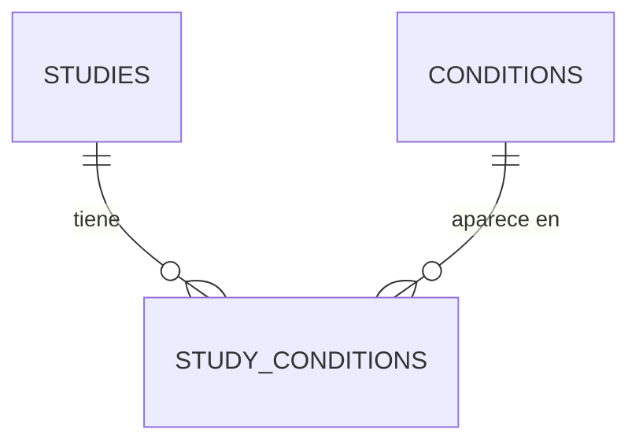

# Clinical Trials Data Pipeline

## Project Approach

The first step was to read the challenge and structure the initial steps. Choosing the right dataset was not an easy task. I opted for the simplest option to dedicate more time to development: option (2), a simple CSV, which proved to have a lot of dirty data to clean.

My second part, if this had concluded, was to address data ingestion from different sources. I've been able to complete little of this part, as I explain at the end of the document.

---

## Design Decisions

Given a single massive CSV of clinical trials, the first step was to be able to ingest it and determine its data problems.

Pipeline implementation decisions:

- **Source:** CSV
- **Language:** Python (with Pandas, which was divine for this)
- **Database:** PostgreSQL, running locally via Docker
- **Version Control:** GitHub

---

## Setting Up the Environment *(section with AI assistance)*

Clone the repo: `https://github.com/Jaumet-007/migx.git`

1. **Install dependencies:** Create a virtualenv and run `pip install -r requirements.txt` (includes pandas, sqlalchemy, etc.).
2. **Start PostgreSQL with Docker:** `docker-compose up -d` (using `docker-compose.yml` with user `migx_user`, pw `migx_password`, port `5434`, db `clinical_db`).

Then develop the code from Visual Studio.

---

## First Approach: Reviewing the Source CSV

The initial analysis of the file led to a simple design:

1. Database schema with 2 tables: `studies` and `conditions`.
2. Loading with Python applying initial cleanups:
   - Convert dates to date type: `df['Start Date'] = pd.to_datetime(df['Start Date'], errors='coerce')`
   - Normalize multi-value fields (separated by comma or pipe), to be loaded in the `conditions` table
   - Remove duplicates within rows with `cond_df.drop_duplicates()` and use `TRUNCATE` for reloads

The result of this phase is `01-create.sql` and `01-upload.py`, which as we will see is not the final version.

To run this first version:

1. **Create schema:** `psql -U migx_user -d clinical_db -f database/01-create.sql` (or from pgAdmin at `http://localhost:5052/browser/`)
2. **Load data:** `python database/01-upload.py`

---

## Analysis of the First Approach

The first approach, while functional as a minimal prototype, suffered from several problems that made it fragile for real-world use:

**Absence of a natural unique identifier.** AI concludes that there should be the standard NCT Number field (mandatory on ClinicalTrials.gov and in almost all Kaggle-derived datasets). Instead, the table used a numeric `study_id` based on the Pandas index, which is fragile and not idempotent (changes if the CSV is reordered or reloaded).

**High redundancy in conditions.** They were stored as repetitions in `study_conditions` without a separate table. The same string ("diabetes", "Arthroplasty Complications") was repeated thousands of times, and without a `conditions` table with unique values it was impossible to fix typos or standardize in one place.

**Loss of key columns.** Only a few columns were loaded, limiting later analytics.

**Data still dirty.** CSV analysis revealed several problems that version 1 did not solve:

- Dates in variable formats (e.g. "2004-10", "2021-01-01") without robust conversion, with risk of NULLs or errors.
- Null values, "NA" or "Unknown" in phases and statuses without validation, causing inconsistencies in aggregations.
- Unhandled mixed types, generating warnings and erroneous coercions.
- No guarantee of insertion order, with risk of loading relationships with non-existent IDs.
- No checks for partial duplicates, invalid values or orphaned relationships.
- No logging or quality report, making it difficult to debug issues.

---

## Second Approach: Entity-Relationship Model

The new schema changes to 3 tables: `studies`, `conditions` and `study_conditions`.

**Advantages:** Greater scalability with millions of records, and without repetition of studies or conditions. The `study_conditions` table acts as an N:M table that relates them.

**Problem detected:** There is repetition in studies. For example, "Sun Protection Factor Assay" appears up to 6 times with different start dates and the rest of the fields equal.

The decision was not to create an additional table for versions of the same study for these reasons:

- We do not have a `version` field in the source that allows clear traceability.
- It would add unnecessary complexity and penalize performance with redundant JOINs.

Instead, we chose to clean and organize the information before storing it using a digital fingerprint (MD5 hash) that combines `brief_title`, `full_title`, `organization_full_name` and `start_date`, ignoring repetitions and keeping the first occurrence.



---

## Second Approach: Data Ingestion with Python

Based on the identified problems, a final pipeline was built. I asked AI to apply the classic rules of repetition, duplicates and human or typological errors, but to also validate other validations from the CSV that could be missed.

**Validations incorporated into the pipeline:**

- Automatic normalization of column names (snake_case + explicit mapping), avoiding errors due to format differences between CSV and SQL schema.
- Generation of `study_key` with deterministic MD5 hash, which eliminates real and partial duplicates idempotently (same CSV = same keys always).
- Detection and warning of unexpected values in statuses, allowing identification of anomalies without aborting the load.
- Option for strict filtering of invalid rows, giving flexibility between tolerance and rigor.
- Clean extraction of conditions (split by comma/pipe, lowercase, minimum length >= 3 characters), reducing noise and empty strings.
- Guaranteed sequential loading (first unique conditions, then map IDs, then studies and relationships), eliminating risk of broken referential integrity.
- Safe type conversion with `pd.to_datetime(errors='coerce')`, handling variable formats without crash.

**Additional validation suggested by AI, arising from several failed loads regarding the CHECK of statuses:** Soft mapping of rare statuses in `overall_status` (e.g. `'AVAILABLE'` translates to `'APPROVED_FOR_MARKETING'`), preventing CHECK constraint violations without losing rows. AI suggests that instead of infinitely expanding the CHECK, given that ClinicalTrials.gov has approximately 15 official statuses, it is easier to scale if in the future it is decided that AVAILABLE is another status: just change script lines instead of altering the table structure.

**Scalability and maintenance improvements** (explicitly requested to AI so that the code would be easier to maintain and extend):

- Modular design with separate functions (`generate_study_key`, `normalize_column_names`, `extract_conditions`, `normalize_statuses`), easy to test, reuse and extend.
- Structured logging with timestamps and levels (INFO / WARNING / ERROR).
- Atomic transaction with `engine.begin()` and `TRUNCATE CASCADE`, ensuring total consistency in reloads.
- Early deduplication with `drop_duplicates(subset='study_key')`, reducing volume before inserting.
- Code prepared for larger volumes: `low_memory=False`, initial `dtype=str`.
- Possibility to migrate to Spark/Parquet without changing the core logic.

---

## Unit Tests

Unit tests guarantee three fundamental things:

**Reliability.** They ensure that cleaning rules (such as separating conditions or normalizing dates) always work the same way, preventing dirty data from ruining business metrics.

**Idempotency.** They validate that the system can process the same information multiple times without duplicating records or corrupting the database.

**Maintenance.** They allow the code to be evolved with confidence. If tomorrow we change a function to improve performance, the tests confirm in seconds that we haven't broken the pipeline logic.

The code and results are in the `/tests` folder.

---

## Data Quality

Immediately after loading the dataset, a Python script was implemented that executes the validation queries and generates a readable report:

```
python database/02-dataquality.py
```

This produces `informe_limpieza_datos.txt` with 6 checks:

1. **Uniqueness in condition names.** Detects if there are duplicate conditions (should return 0 rows, since `condition_name` is UNIQUE). Prevents counts from inflating artificially.

2. **Referential integrity in relationships.** Verifies that there are no invalid references in `study_conditions`. Guarantees that JOINs in analytics work correctly.

3. **Completeness in key fields.** Counts NULL or empty values in critical columns (title, organization, status, date). Without a title you cannot identify a study; without a date you cannot calculate its duration.

4. **Logical consistency in dates.** Detects completion dates earlier than start dates, unrealistic future dates or studies completed without an end date.

5. **Outliers in number of conditions per study.** Identifies studies with 0 conditions or with an excessive number (more than 10 could be a parsing error in the CSV).

6. **Partial duplicates.** Groups studies by title and organization and displays groups with more than 1 record, to detect cases like the Bayer SPF with 6 entries.

### Data Quality Conclusion

**Critical findings:**

- 44% of records (219,166) do not have `start_date`, which prevents temporal analysis.
- 32 studies have erroneous dates (e.g. year 2026).
- 2,671 records have more than 10 conditions, possible parsing error.
- 763 groups with same title and company but inconsistent data (e.g. Bayer with 12 records and 9 different dates; also NCI, Alcon and Novo Nordisk).

**Diagnosis:** Referential integrity correct, but source data dirty.

**Required actions:**

- Validate if NULLs and duplicates come from the source CSV.
- Review the separation logic in the "Conditions" column.
- Establish a business rule for deduplication (e.g. keep oldest or most complete record).
- Review a sample of problem rows for joint validation.

---

## Analytics Required in the Challenge

The challenge asks for a series of questions to be answered through SQL queries. Given that current LLMs are quite good at generating SQL, the queries were generated with AI assistance. That said, with 30 years working with SQL, I am in a position to generate them myself without problem and to explain them in detail if required.

The result of all queries (analytics/queries.sql) has been summarized in the report:
`analytics/analytics_report.md`

```
psql -U migx_user -d clinical_db -f analytics/queries.sql
```

---

## Architecture Diagram (omitting version 1)


---

## Pending Tasks: Other Data Sources

**XML.** Would use `xml.etree.ElementTree` or `lxml` to parse the XML and extract equivalent fields. The change would be minimal: replace `pd.read_csv()` with a `parse_xml_to_df(xml_path)` function that returns a DataFrame with the same structure.

**API.** Leveraging Python functions to load onto a DataFrame:

```python
def load_from_api(query: str = "cond=cancer", max_results=1000) -> pd.DataFrame:
    url = "https://clinicaltrials.gov/api/v2/studies"
    params = {"query.cond": query, "pageSize": 1000, "format": "json"}
    response = requests.get(url, params=params)
    data = response.json().get('studies', [])
    df = pd.json_normalize(data)
    return df
```

**Other databases.** Using SQLAlchemy to read directly onto a DataFrame:

```python
def load_from_db(db_url: str, query: str = "SELECT * FROM clinical_trials") -> pd.DataFrame:
    engine = create_engine(db_url)
    return pd.read_sql(query, engine)
```

---

## Other Pending Tasks

- **CI/CD:** Create `.github/workflows/ci.yml` with GitHub Actions to run on each push: dependency installation, quality validation and Docker image building.
- **Secret management:** Add `.env.example`, include `.env` in `.gitignore` and update the code to use `python-dotenv` + `os.getenv()`.
- **Safe CI:** Take `DB_URL` from GitHub Secrets, not from files.
- **Orchestration:** Add a minimal flow (ETL > validations > analytics).
- **Production:** Plan migration to Secrets Manager (Vault / AWS / Azure), credential rotation and roles with principle of least privilege.

---

## Bonus Questions

**Scalability: How would you handle 100 times more data volume?**

Use cloud storage with compressed formats like Parquet.
Partitioning of tables by date when volume requires it.
Consider the use of materialized views to accelerate frequent queries.

**Data Quality: What additional validations would you implement?**

Add completion_date field to have the actual date range of the study.
Add NCT id as study key if possible.
Add study version if possible to adapt a new table: 1 study: N versions (with different StartDate).
Generate a dictionary/table of terms. Not all text is valid.
Review the congruence of all data types.
Review what error values or NULLs there are and we shouldn't allow.

**Regulatory Compliance: What would need to be considered in a GxP environment?**

Three environment layers: DEV, TEST and PROD.
Auditing of record creation and modification (user and date).
Security based on user typology and roles.
Standardization in coding and nomenclature.

**Monitoring: How would you monitor this pipeline in production?**

Throughput, latency, error rate, processed rows and quality metrics (nulls, duplicates).
Logging at multiple levels.
Automatic alerts on critical errors or breach of time commitments (RPO/RTO).
Monitoring of indexes and database statistics, especially if there are frequent heavy queries.

**Security: What measures would you apply for sensitive clinical data?**

Use of secrets managers (e.g. AWS Secrets Manager) for credentials.
Security based on user roles.
Database with data anonymization and assess cost/benefit of encryption.
Access auditing.
